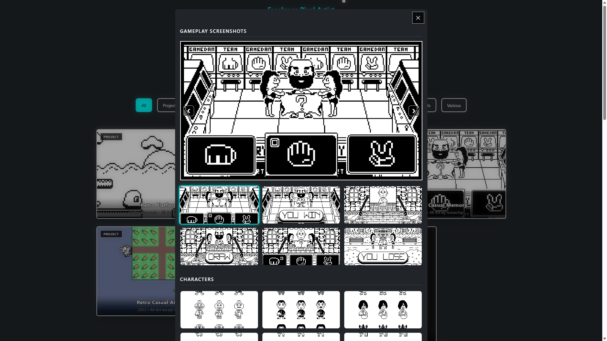

# Noisechip Portfolio

A portfolio website for a pixel artist, built to showcase artwork through a clean interface, category filters and interactive modal navigation.

## Live Demo

https://noisechip.com/

## Overview

Noisechip Portfolio is a responsive front-end project created for a freelance pixel artist.  
The website focuses on presenting pixel art projects clearly, with a dynamic gallery system and simple navigation for different artwork categories.

## Features

- Responsive layout
- Dynamic artwork gallery
- Category filters
- Interactive image modal
- Previous / next navigation
- Contact section
- Scroll-to-top button
- SEO and social sharing meta tags

## Technologies Used

- HTML5
- CSS
- Bootstrap 5
- JavaScript

## Project Structure

```text
noisechip-portfolio/
├── index.html
├── css/
│   └── styles.css
├── js/
│   └── app.js
├── img/
├── files/
│   └── noisechip-resume.pdf
└── README.md
```


## What I Learned

While building this project, I improved my understanding of responsive layouts, Bootstrap components, DOM manipulation and organizing interactive content with JavaScript.
I also worked on presenting visual content in a clear way, improving the user experience for browsing artwork categories and viewing project details.

## Screenshots



## Contact

Created by Alejandro Arevalo Rojas.

GitHub: https://github.com/alejandroarevaloprogrammer

Portfolio: https://alejandroarevalorojas.com/
